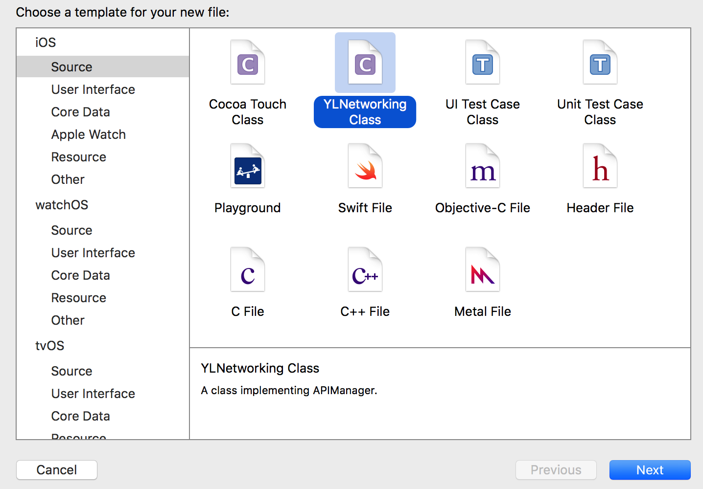
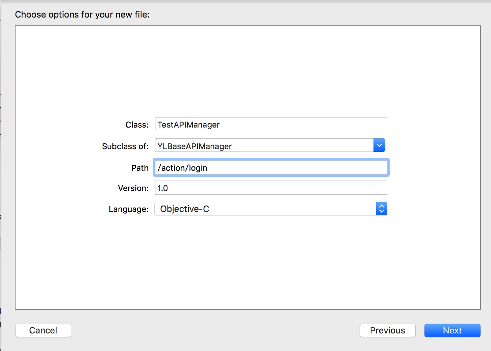
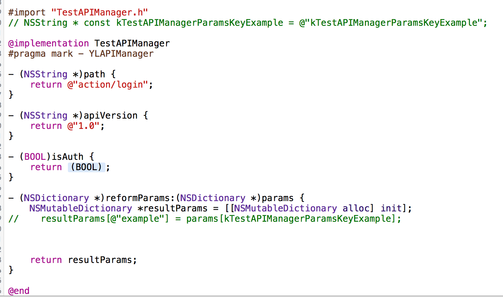

[YLNetworking](http://github.com/ypli-chn/YLNetworking)的模板，将`YLNetworking Class.xctemplate`复制到`/Applications/Xcode.app/Contents/Developer/Platforms/iPhoneOS.platform/Developer/Library/Xcode/Templates/File\ Templates/Source/`目录下

### 效果

##### 新建文件：

##### 新建完成

